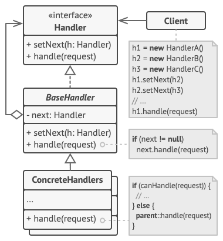

# Chain of Command Design Pattern

## Definition

Chain of Responsibility is a behavioral design pattern that lets you pass requests along a chain of handlers. Upon receiving a request, each handler decides either to process the request or to pass it to the next handler in the chain.

## Example
### System login workflow

The main example ia a bit like in the diagram below, but here we're working with the following chain of events in order to log user to system:
* checking system (Server) resources availability
* user authentication
* user authorization roles check

## Other

- Example is from awesome website [Refactoring Guru](https://refactoring.guru)
- There is another example attached from Hyperskill (xml wrapper with use of functional programming)

___

### All patterns

```mermaid
mindmap
%%{init: {'theme':'base'}}%%
    root)Design Patterns( 
        (Creational)
            (Singleton)
            (Builder)
            (Prototype)
            (Factory Method)
            (Abstract Factory)
     (Structural)
             (Facade)
             (Proxy)
             (Decorator)
             (Composite)
             (Flyweight)
             (Bridge)
             (Adapter)
     (Behavioral)
             (Chain of Responsibility)
             (Command)
             (Iterator)
             (Mediator)
             (Memento)
             (Observer)
             (State)
             (Strategy)
             (Template Method)
             (Visitor)
```